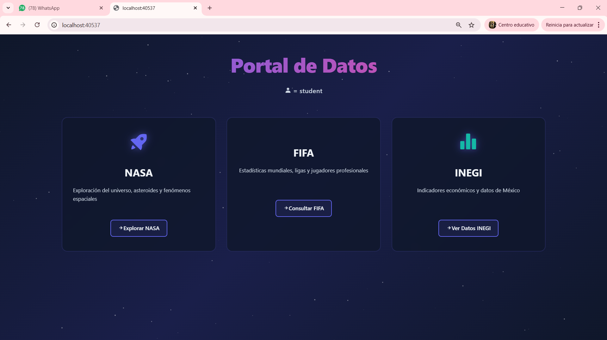
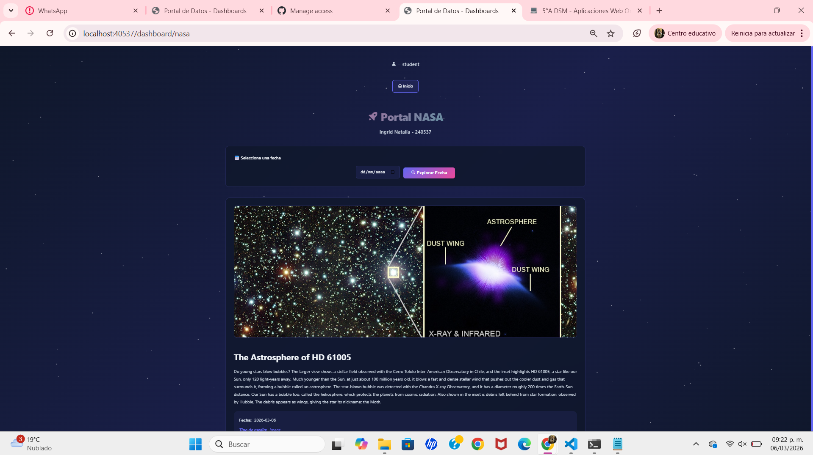
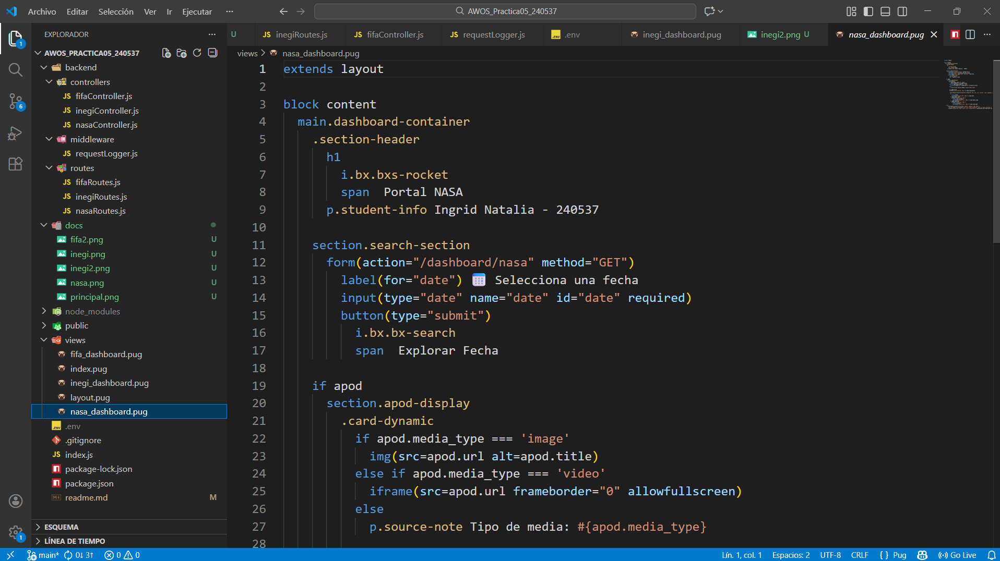
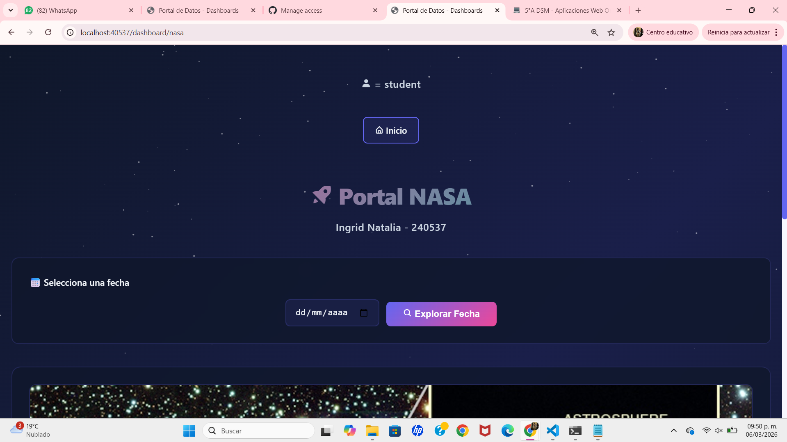
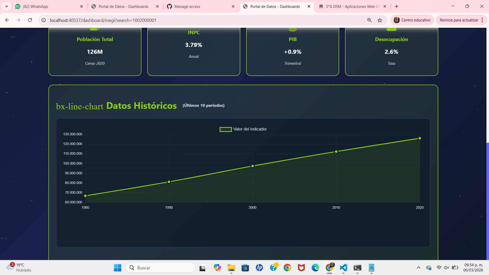
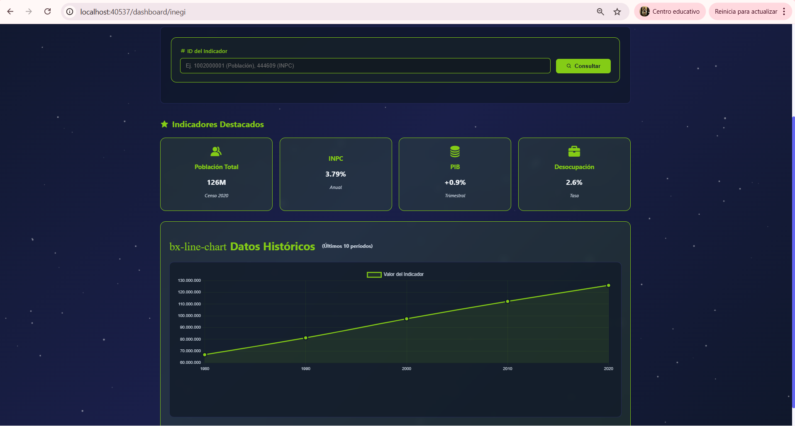
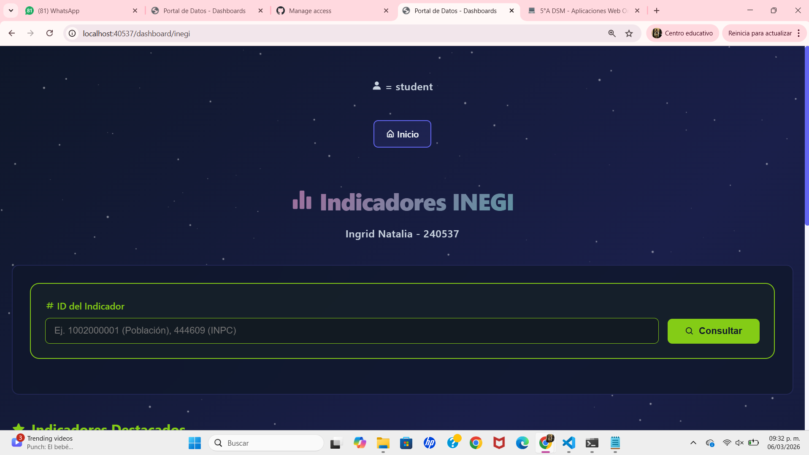
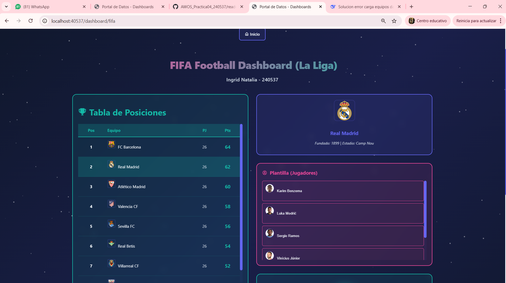
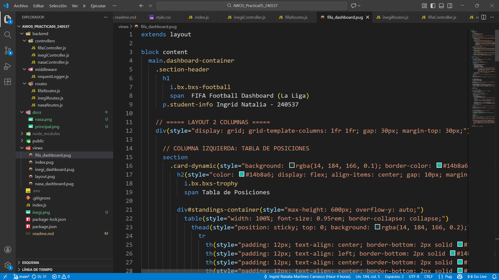
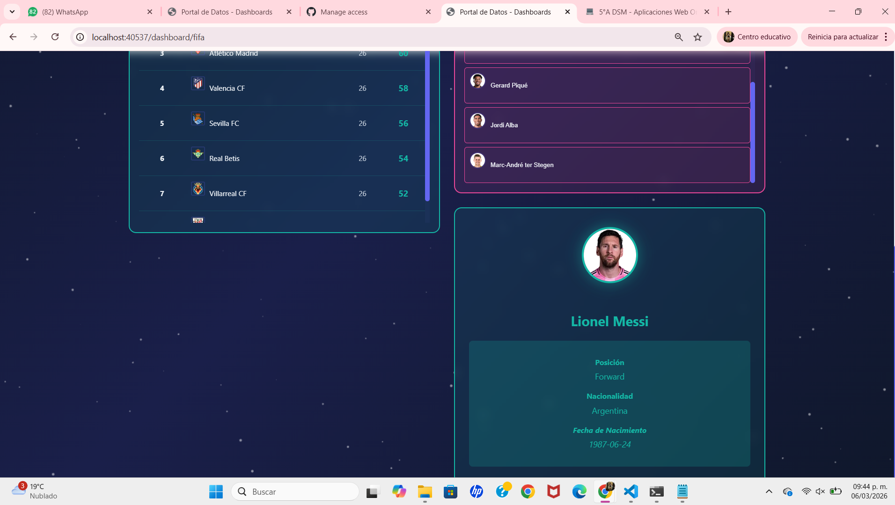

# 🚀 Consumo de APIs Públicas en Tiempo Real
### NASA · FIFA · INEGI

**Desarrollo Web Fullstack:** Aplicación robusta con Node.js + Express + Pug que consume tres bases de datos públicas mediante arquitectura de **Proxy Seguro**.


---

## 👤 Información de la Estudiante
* **Nombre:** Ingrid Natalia Martínez Carrasco
* **Matrícula:** 240537
* **Institución:** Universidad Tecnológica de Xicotepec de Juárez
* **Carrera:** Ingeniería en Desarrollo de Software
* **Asignatura:** AWOS - Almacenamiento y Consulta de Datos en Web
* **Perfil de GitHub:** [NataliaMtz123](https://github.com/NataliaMtz123)

---

## 📝 Descripción del Proyecto

Este sistema implementa una arquitectura **MVC (Modelo-Vista-Controlador)** donde el Backend actúa como un intermediario seguro. El servidor consulta los endpoints oficiales, inyecta las credenciales (API Keys) y devuelve el JSON procesado al frontend, garantizando que las API Keys nunca se expongan al cliente.

### Características Principales

✅ **Tres APIs Públicas Integradas:** NASA, FIFA e INEGI  
✅ **Gestión Segura de API Keys:** Variables de entorno (.env)  
✅ **Landing Page Interactiva:** Interfaz moderna con Pug + CSS Personalizado  
✅ **Dashboards Dinámicos:** Consumo de datos cualitativos y cuantitativos  
✅ **60+ Endpoints Disponibles:** 20 endpoints por cada API  
✅ **Validación de Errores:** Manejo de excepciones y datos de respaldo  
✅ **Código Full Stack:** Backend en Node.js y Frontend en JavaScript vanilla  

---

## 📅 Guía de Fases de Desarrollo

| Fase | Título | Descripción | Estatus |
|:-----|:-------|:------------|:--------|
| **1** | **Infraestructura Base** | Configuración de `package.json` e instalación de dependencias (express, dotenv, axios, pug). | ✅ Finalizado |
| **2** | **Servidor y Estructura MVC** | Creación del servidor Express, configuración de carpetas (`/backend`, `/views`, `/public`), middleware de logging. | ✅ Finalizado |
| **3** | **Controladores y Rutas (60+ Endpoints)** | Implementación de lógica asíncrona para consumir NASA, FIFA e INEGI con datos de respaldo. | ✅ Finalizado |
| **4** | **Interfaz de Usuario (UX/UI)** | Landing Page y 3 Dashboards dinámicos con Pug, CSS personalizado y efecto de estrellas. | ✅ Finalizado |
| **5** | **Correcion de errores de APIs** | Documentación completa en README.md, tabla de 60 endpoints, pruebas funcionales capturadas. | ✅ Finalizado |
| **6** | **Pruebas y Documentación** | Documentación completa en README.md, tabla de 60 endpoints, pruebas funcionales capturadas. | ✅ Finalizado |

---

## 📊 Tabla de 60 Endpoints Disponibles

### NASA API (20 endpoints) - https://api.nasa.gov

| # | Endpoint | Método | Descripción | Parámetros |
|:--|:---------|:-------|:------------|:-----------|
| 1 | `/api/nasa/apod` | GET | Imagen astronómica del día | `date` (YYYY-MM-DD), `hd` (boolean) |
| 2 | `/api/nasa/apod/random` | GET | Imagen astronómica aleatoria | `count` (número de imágenes) |
| 3 | `/api/nasa/earth/imagery` | GET | Imagen satelital de ubicación específica | `lat`, `lon`, `dim`, `date` |
| 4 | `/api/nasa/earth/assets` | GET | Disponibilidad de imágenes satelitales | `lat`, `lon`, `begin`, `end` |
| 5 | `/api/nasa/neo/feed` | GET | Asteroides cercanos a la Tierra | `start_date`, `end_date` |
| 6 | `/api/nasa/neo/browse` | GET | Listado paginado de asteroides | `page`, `size` |
| 7 | `/api/nasa/neo/lookup/:id` | GET | Detalle de asteroide por ID | `asteroid_id` |
| 8 | `/api/nasa/donki/flr` | GET | Erupciones solares | `startDate`, `endDate` |
| 9 | `/api/nasa/donki/cme` | GET | Eyecciones de masa coronal | `startDate`, `endDate` |
| 10 | `/api/nasa/donki/gst` | GET | Tormentas geomagnéticas | `startDate`, `endDate` |
| 11 | `/api/nasa/donki/ips` | GET | Partículas interplanetarias | `startDate`, `endDate` |
| 12 | `/api/nasa/donki/mpc` | GET | Conexiones magnéticas | `startDate`, `endDate` |
| 13 | `/api/nasa/donki/rbe` | GET | Mejoras del cinturón de radiación | `startDate`, `endDate` |
| 14 | `/api/nasa/donki/hss` | GET | Corrientes de alta velocidad | `startDate`, `endDate` |
| 15 | `/api/nasa/donki/wsa` | GET | Predicciones WSA-Enlil | `startDate`, `endDate` |
| 16 | `/api/nasa/techport/projects` | GET | Proyectos tecnológicos | `updatedSince` |
| 17 | `/api/nasa/techport/projects/:id` | GET | Detalle de proyecto | `project_id` |
| 18 | `/api/nasa/mars/rovers` | GET | Listado de rovers en Marte | - |
| 19 | `/api/nasa/mars/curiosity/photos` | GET | Fotos del rover Curiosity | `sol`, `camera`, `page` |
| 20 | `/api/nasa/mars/opportunity/photos` | GET | Fotos del rover Opportunity | `sol`, `camera`, `page` |

### FIFA API (20 endpoints) - https://v3.football.api-sports.io

| # | Endpoint | Método | Descripción | Parámetros |
|:--|:---------|:-------|:------------|:-----------|
| 1 | `/api/fifa/leagues` | GET | Listado de todas las ligas | `current`, `country`, `type` |
| 2 | `/api/fifa/leagues/:id` | GET | Detalle de liga específica | `league_id` |
| 3 | `/api/fifa/leagues/:id/seasons` | GET | Temporadas disponibles de una liga | `league_id` |
| 4 | `/api/fifa/countries` | GET | Listado de países disponibles | `search` |
| 5 | `/api/fifa/teams` | GET | Búsqueda de equipos | `search`, `league`, `season` |
| 6 | `/api/fifa/teams/:id` | GET | Detalle de equipo específico | `team_id` |
| 7 | `/api/fifa/teams/:id/statistics` | GET | Estadísticas de equipo | `team_id`, `league`, `season` |
| 8 | `/api/fifa/players` | GET | Búsqueda de jugadores | `search`, `season`, `league` |
| 9 | `/api/fifa/players/:id` | GET | Detalle de jugador específico | `player_id` |
| 10 | `/api/fifa/players/:id/seasons` | GET | Temporadas de un jugador | `player_id` |
| 11 | `/api/fifa/standings` | GET | Tabla de posiciones | `league`, `season` |
| 12 | `/api/fifa/fixtures` | GET | Próximos partidos | `league`, `season`, `from`, `to` |
| 13 | `/api/fifa/fixtures/live` | GET | Partidos en vivo | `league` |
| 14 | `/api/fifa/fixtures/:id` | GET | Detalle de partido específico | `fixture_id` |
| 15 | `/api/fifa/fixtures/:id/statistics` | GET | Estadísticas de partido | `fixture_id` |
| 16 | `/api/fifa/fixtures/:id/events` | GET | Eventos de partido | `fixture_id` |
| 17 | `/api/fifa/fixtures/:id/lineups` | GET | Alineaciones de partido | `fixture_id` |
| 18 | `/api/fifa/fixtures/headtohead` | GET | Historial entre equipos | `h2h` (IDs separados por -) |
| 19 | `/api/fifa/predictions` | GET | Predicciones de partidos | `fixture` |
| 20 | `/api/fifa/trophies` | GET | Trofeos de jugador/equipo | `player`, `team` |

### INEGI API (20 endpoints) - https://www.inegi.org.mx/app/api/indicadores/desarrolladores/

| # | Endpoint | Método | Descripción | Parámetros |
|:--|:---------|:-------|:------------|:-----------|
| 1 | `/api/inegi/poblacion/total` | GET | Población total de México | `year` (año) |
| 2 | `/api/inegi/poblacion/estados` | GET | Población por estado | `year` |
| 3 | `/api/inegi/poblacion/municipios` | GET | Población por municipio | `state`, `year` |
| 4 | `/api/inegi/poblacion/edades` | GET | Población por grupos de edad | `year` |
| 5 | `/api/inegi/poblacion/genero` | GET | Población por género | `year` |
| 6 | `/api/inegi/economia/pib` | GET | Producto Interno Bruto | `year`, `quarter` |
| 7 | `/api/inegi/economia/pib/estados` | GET | PIB por estado | `year` |
| 8 | `/api/inegi/economia/inflacion` | GET | Índice de inflación | `start`, `end` |
| 9 | `/api/inegi/economia/empleo` | GET | Tasa de empleo/desempleo | `year`, `month` |
| 10 | `/api/inegi/economia/indicadores` | GET | Indicadores económicos diversos | `indicador` (ID) |
| 11 | `/api/inegi/vivienda/total` | GET | Total de viviendas | `year` |
| 12 | `/api/inegi/vivienda/tipos` | GET | Tipos de vivienda | `year` |
| 13 | `/api/inegi/vivienda/servicios` | GET | Acceso a servicios básicos | `year` |
| 14 | `/api/inegi/educacion/escolaridad` | GET | Nivel de escolaridad | `year`, `state` |
| 15 | `/api/inegi/educacion/alfabetismo` | GET | Tasa de alfabetismo | `year` |
| 16 | `/api/inegi/salud/derechohabiencia` | GET | Población con derechohabiencia | `year` |
| 17 | `/api/inegi/salud/seguros` | GET | Tipo de seguro médico | `year` |
| 18 | `/api/inegi/migracion/flujos` | GET | Flujos migratorios | `year` |
| 19 | `/api/inegi/indicador/:id` | GET | Indicador específico por ID | `id_indicador` |
| 20 | `/api/inegi/buscar` | GET | Búsqueda de indicadores | `q` (término de búsqueda) |

---

## Evidencias del funcionamiento

### 1️⃣ Página Principal - Portal de Datos
**Descripción:** Página inicial para acceder a los módulos de **NASA, FIFA e INEGI**.

**Funcionamiento:** Actúa como centro de navegación hacia cada API disponible.



---

### 2️⃣ NASA - APOD (Imagen del Día)
**Descripción:** Consulta de la imagen astronómica del día.

**Funcionamiento:** Petición GET al endpoint `apod` usando una fecha seleccionada.

**Resultado:** Imagen **The Astrosphere of HD 61005** con su explicación científica.



---

### 3️⃣ NASA - APOD Histórica
**Descripción:** Consulta de imágenes astronómicas de fechas anteriores.

**Funcionamiento:** Petición GET al endpoint `apod` con fecha específica.

**Resultado:** Imagen **Reflections on Planet Earth** tomada desde la ISS.



---

### 4️⃣ Portal NASA
**Descripción:** Interfaz para consultar imágenes APOD por fecha.

**Funcionamiento:** El usuario selecciona una fecha y el sistema muestra la imagen correspondiente.



---

### 5️⃣ INEGI - Dashboard
**Descripción:** Panel con indicadores económicos y demográficos.

**Funcionamiento:** Consumo de la API del **Banco de Indicadores Económicos (BIE)**.

**Resultado:** Indicadores como **INPC, PIB y Desocupación** con gráfica histórica.



---

### 6️⃣ INEGI - Consulta de Indicadores
**Descripción:** Búsqueda de indicadores mediante ID.

**Funcionamiento:** Petición GET al endpoint del indicador en la API del INEGI.

**Resultado:** Datos como **población total, inflación y PIB**.



---

### 7️⃣ INEGI - Consulta por ID
**Descripción:** Consulta directa de indicadores específicos.

**Funcionamiento:** El usuario ingresa el ID y el sistema obtiene los datos desde la API.



---

### 8️⃣ FIFA - Dashboard de Liga
**Descripción:** Visualización de la tabla de posiciones de **La Liga**.

**Funcionamiento:** Consumo de API de fútbol para mostrar equipos y puntos.



---

### 9️⃣ FIFA - Detalles de Equipo
**Descripción:** Información de un equipo seleccionado.

**Funcionamiento:** Consulta de datos del equipo y su plantilla de jugadores.

**Resultado:** Información del **FC Barcelona**.



---

### 🔟 FIFA - Detalles de Jugador
**Descripción:** Información de un jugador específico.

**Funcionamiento:** Petición al endpoint del jugador seleccionado.

**Resultado:** Datos de **Lionel Messi** (posición, nacionalidad y nacimiento).




---

## 🛠️ Instalación y Uso

### 1️⃣ Prerequisitos
- **Node.js v18+** instalado
- **npm v9+** instalado
- Navegador moderno (Chrome, Firefox, Safari, Edge)

### 2️⃣ Clonar y Configurar

```bash
# Clonar el repositorio
git clone https://github.com/NataliaMtz123/AWOS_Practica05_240537.git
cd AWOS_Practica05_240537

# Instalar dependencias
npm install

# Crear archivo .env (basado en .env.example)
cp .env.example .env